# OpenSUSE - Uyuni Salt Event Processor Extraction, Containerization and Deployment Integration

This project focuses on extracting and containerizing the **Salt event processor** from Uyuni's Tomcat server into a standalone containerized service, improving performance and resource management.

## Background

**[Uyuni](https://www.uyuni-project.org)** is an **open-source infrastructure management solution** that provides systems management capabilities for various Linux servers. It is developed in the [openSUSE](https://www.opensuse.org) ecosystem. It integrates with [SaltStack](https://docs.saltproject.io/salt/user-guide/en/latest/index.html#) for event processing and configuration management. The Salt event processor is responsible for handling events from Salt minions and processing them.

**Uyuni's Salt event processor** runs within Tomcat alongside the web application, which can cause performance bottlenecks during high event processing loads. This project separates the Salt event processing logic into a dedicated containerized service that maintains the same functionality while improving system architecture and enabling better scalability.

**[Uyuni-tools](https://github.com/uyuni-project/uyuni-tools)** is the comprehensive toolset for managing Uyuni deployments, providing installation, lifecycle management, and monitor. This project also integrates the new event processor container into Uyuni-tools for deployment and lifecycle management.

## Project Status

The project went through phases from research and extraction to containerization and deployment integration.

### Deliverables Timeline
- [x] **Phase 0-1**: Environment setup and analysis 
- [x] **Phase 2**: Salt event processor extraction
- [x] **Phase 3**: Container implementation and Uyuni-tools integration 
- [x] **Phase 4**: Testing and optimization 

## Implementation
- [PR#10493](https://github.com/uyuni-project/uyuni/pull/10493)
- [PR#626](https://github.com/uyuni-project/uyuni-tools/pull/626)

## Documentation

### Setup & Environment
- [Uyuni Development Environment Setup](doc/Uyuni-Development-Environment-Setup.md)
- [Uyuni Server Production Environment Setup](doc/Uyuni-server-production-environment-setup.md)

### Salt Event Processor Extraction Implementation and Testing Details
- [Salt Event Processor Extraction Implementation](doc/Salt-Event-Processor-Extraction-Implementation.md)
- [Salt Event Processor Extraction Initial Testing](doc/Salt-Event-Processor-Extraction-Initial-Testing.md)

### Containerization and deployment 
- [Salt Event Processor Container Implementation](doc/Salt-Event-Processor-Container-Implementation.md)
- [Salt Event Processor Image Build and Test](doc/Salt-Event-Processor-Image-Build-and-Test.md)

### Uyuni-tools Integration 
- [Uyuni-tools Integration for Salt Event Processor](doc/Event-Processor-Uyuni-tools-Integration.md)
- [Testing Salt Event Processor Integration with Uyuni-Tools](doc/Testing-Salt-Event-Processor-Uyuni-Tools-Integration.md)
- [Integration of Java Debug Port](doc/Integration-of-java-debug-port.md)
- [Testing of integration of java debug port](doc/Testing-of-integration-of-java-debug-port.md)

### System Design and Architecture related log
- [Uyuni Salt Event Processing System and Uyuni-tools Integration: Design, and Scaling Considerations](doc/Current-Design-and-Scaling-Considerations.md)

### Troubleshooting logs (pending upload)
- [Takeaway from Uyuni-tools Integration](doc/Uyuni-tools-Integration-takeaways.md)
- [Troubleshooting log of java debug port integration](doc/Troubleshooting-log-java-debug-port-integration.md)

## Key Features

- **Standalone Service**: Extracted Salt event processor maintains full functionality
- **Database Integration**: Connects to PostgreSQL for event processing
- **Container Support**: Podman-based containerization
- **Uyuni-tools Integration**: Deployment and configuration management
- **Health Monitoring**: Service health checks and monitoring endpoints

## Architecture Overview

The solution transforms the current integrated architecture into a microservices approach:
- **Before**: Salt events processed within Tomcat alongside web application

```mermaid
%%{ init : { "theme" : "neutral", "flowchart" : { "curve" : "linear" }}}%%
flowchart TD
    subgraph "PRIVIOUS STATE: Event Processor Server Embedded in Tomcat Server"
        subgraph "Container Runtime (Podman/Kubernetes)"
            direction TB
            
            subgraph "Core Services"
                A[uyuni-server Container]
                B[uyuni-db Container]
            end
            
            subgraph "Existing Microservices"
                C[uyuni-hub-xmlrpc Container]
                D[uyuni-server-attestation Container]
                E[uyuni-saline Container]
            end
        end
        
        A --> H[Web UI & API]
        A --> I[🟢 Salt Event Processing embeded in Tomcat]
        A --> J[Other Server Functions]
        I --> N[🟢 Event Processing logic]
        A --> O[Salt Master]
        B --> P[PostgreSQL Database]
        
        style I fill:#ccffcc,stroke:#00cc00,stroke-width:3px
        style N fill:#ccffcc,stroke:#00cc00,stroke-width:3px
        style A fill:#ffcccc
        style B fill:#e6ccff
        style C fill:#f0f8ff
        style D fill:#f0f8ff
        style E fill:#f0f8ff
        
        subgraph "Uyuni-tools: infrastucture Management Tools"
            K[mgradm - Server Management]
            L[mgrctl - Operations]
            M[mgrpxy - Proxy Management]
        end
        
        
        %% Database connections
        A -.-> B
        C -.-> B
        
        %% External connections
        K --> A
        L --> A
        
    end
```

- **After**: Dedicated containerized service handling Salt event processing independently

```mermaid
%%{ init : { "theme" : "neutral", "flowchart" : { "curve" : "linear" }}}%%
flowchart TD
    subgraph "TARGET STATE: Extracted Event Processor Microservices Architecture"
        subgraph "Container Runtime (Podman/Kubernetes) - Enhanced"
            direction TB
            
            subgraph "Core Services - Optimized"
                AA[uyuni-server Container]
                BB[uyuni-db Container]
            end
            
            subgraph "Microservices"
                CC[uyuni-hub-xmlrpc Container]
                DD[uyuni-server-attestation Container]
                EE[uyuni-saline Container]
                FF["🟢 uyuni-server-salt-event-processor (extracted)"]
            end
            
        end
        
        AA --> JJ[Web UI & API Only]
        AA --> KK[Other Server Functions]
        AA --> QQ[Salt Master]
        BB --> MM[PostgreSQL Database]
        FF --> LL[🟢 Event Processing logic]
        
        style FF fill:#ccffcc,stroke:#00cc00,stroke-width:3px
        style LL fill:#ccffcc,stroke:#00cc00,stroke-width:2px
        style AA fill:#ccffff
        style BB fill:#e6ccff
        style CC fill:#f0f8ff
        style DD fill:#f0f8ff
        style EE fill:#f0f8ff
        
        subgraph "Uyuni-tools: infrastucture Management Tools - Integrated with Event processor"
            NN[mgradm - Server Management]
            OO[mgrctl - Operations]
            PP[mgrpxy - Proxy Management]
        end
        
        
        %% Database connections
        AA -.-> BB
        CC -.-> BB
        FF -.-> BB
        
        %% External connections
        NN --> AA
        OO --> AA
        
        %% New service management
        NN --> FF
    end
```

## Contributing

This project is part of the [openSUSE](https://www.opensuse.org) GSoC 2025 program. For questions or contributions, please refer to the Uyuni project community channels.

## Acknowledgement

I want to express my sincere appreciation to my mentors @cbosdo and @rjmateus for their outstanding technical guidance and commitment to quality throughout this work. Their high standards and comprehensive understanding of systems architecture challenged me to create solutions of real value. Their thoughtful guidance helped me work through  technical obstacles. The openSUSE community's supportive culture eased my path to engage and navigate, creating an environment where open source contributions are approachable for newcomers.

## Related Links

- [Original GSoC Issue](https://github.com/openSUSE/mentoring/issues/210)
- [Uyuni Project](https://github.com/uyuni-project/uyuni)
- [Uyuni-tools](https://github.com/uyuni-project/uyuni-tools)
