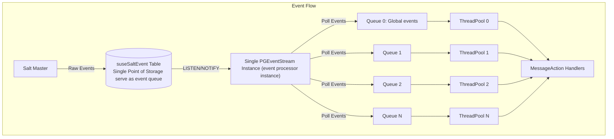
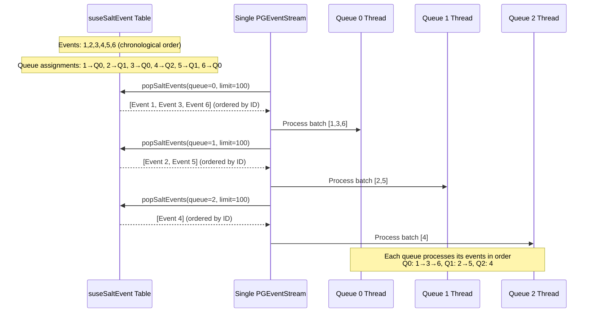
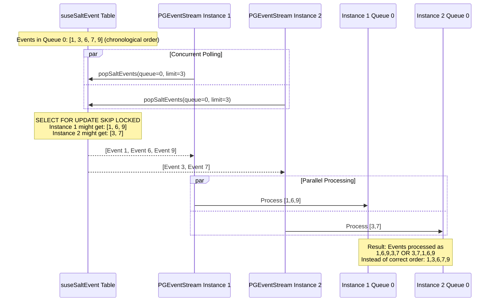

# Uyuni Salt Event Processing System and Uyuni-tools Integration: Design, and Scaling Considerations

This document explains why the event processor Uyuni-tools integration enforces only one replica/instance of the event processor. The following analyzes the current event processor architecture design, potential bottlenecks, and scalability. The analysis dives deep into the current project design consideration to explain why multiple instances deployment and horizontal scaling is not optimal solution for current extracted event processor.

## Current Salt Event Processing Architecture:



## Event Flow

Here's how Salt events flow through the Uyuni system:

1. Event Ingestion

    ```
    Salt Master -> suseSaltEvent table (PostgreSQL)
    ```

    - Salt Master receives events from minions (job results, status updates, etc.).
    - All events are immediately stored in the `suseSaltEvent` database table
    - Events are sorted by ID to maintain processing order
    - Events get a `queue` number assigned based on `hash(minion_id) % N + 1`
2. Event Detection and polling

    ```
    suseSaltEvent table -> PGEventStream (via PostgreSQL LISTEN/NOTIFY) polls events from table -> Fetches event batches
    ```

    - Single `PGEventStream` instance listens for database notifications
    - When new events arrive, PostgreSQL sends a notification to the processor
    - The processor `PGEventStream` starts polling the `suseSaltEvent` table using `SELECT FOR UPDATE SKIP LOCKED`
    - Events are fetched in batches (typically 100 events at a time)
    - Successfully fetched events are immediately deleted from the table to ensure idempotent
3. Event Distribution

    ```
    Event batches → Thread pools (based on queue number)
    ```

    - Each event batch is assigned to a thread pool based on the event's `queue` number
    - Queue 0: Global events (no specific minion)
    - Queue 1-N: Minion-specific events distributed by hash
    - Each thread pool processes events independently but sequentially
4. Event Processing

    ```
    Thread pools → PGEventListener → MessageAction handlers
    ```

    - `PGEventListener` receives events from thread pools
    - Parses the raw event data and determines the event type
    - Routes events to appropriate `MessageAction` handlers (e.g., `JobReturnEventMessageAction`)
    - Each handler implements specific business logic for that event type

## How event processing order is guaranteed in current design?

In the current event processing system, all events flow through one table: `suseSaltEvent`. The system uses PostgreSQL's built-in lock mechanism `SELECT FOR UPDATE SKIP LOCKED` to lock rows when the `PGEventStream` processor polls events from the table. For example, if Instance 1 is processing events 1, 2, 3 into a batch, those rows get locked. When events are sent to processing queues, they are ordered `ORDER BY id` within each batch. Therefore, each queue's thread pool processes events in the order received.

This is the key mechanism by which a single event processor instance can guarantee the processing order of events. However, multiple instances would disrupt this event processing order.

Current single event processor instance `PGEventStream` flow:



## Why we enforce one event processor instance in Uyuni-tools?

Now we can answer why we enforce one event processor instance in Uyuni-tools based on the current event processing design. To answer this, let's assume we have multiple event processor instances: `PGEventStream 1` and `PGEventStream 2`. If Instance 1 is processing events 1, 2, 3, those rows get locked. Instance 2's query will **skip** those locked rows and grab events 4, 5, 6 instead. Both instances process their batches **simultaneously**.

Assuming all events 1, 2, 3, 4, 5, 6 are assigned to the same queue after hashing. In a multiple instance system, we cannot guarantee which batch arrives at the queue first. Event batch [4, 5, 6] might be sent to the queue before [1, 2, 3], breaking the chronological order of event processing. That is why implementing multiple replicas of event processor will change the underline logic of event processor, so our Uyuni-tools integration enforced one replica of event processor.

Multiple event processor instances flow:



## How the Current System Scales

The main scalability strategy of the current implementation focuses on vertical scaling, which is well-suited for Uyuni's estimated user base. Why?

- Most deployments manage 100-10,000 systems (manageable load)
- Salt event processing is typically bursty rather than sustained high-throughput
- Modern hardware can handle significant event volumes with proper resource allocation

## Potential Bottlenecks with Single Instance Implementation

Though the current implementation is well-suited for Uyuni's user base, we still need to identify bottlenecks in this system for potential improvements in large-scale deployments.

1. Database Bottleneck

   All events flow through one `suseSaltEvent` table, using PostgreSQL's built-in lock mechanism `SELECT FOR UPDATE SKIP LOCKED` to achieve idempotency. This approach is limited by database I/O and connection capacity. Given the current user base, we can scale vertically, but this may eventually hit hardware limits.

2. Single Point of Processing

   Current event processing uses one `PGEventStream` instance to handle all events from the database. This creates a single point of failure and processing bottleneck.

3. Sequential Polling Limitation

   Even with thread pools, the polling across different queues is sequential. High-volume events in one queue can block processing of events in other queues.


This singleton design constraint means that:

- Horizontal scaling is not working under the current architecture, The event processing system is not built for multi-instance deployment patterns
- Resource allocation is limited to vertical scaling (CPU/memory increases) rather than horizontal scaling (additional instances)