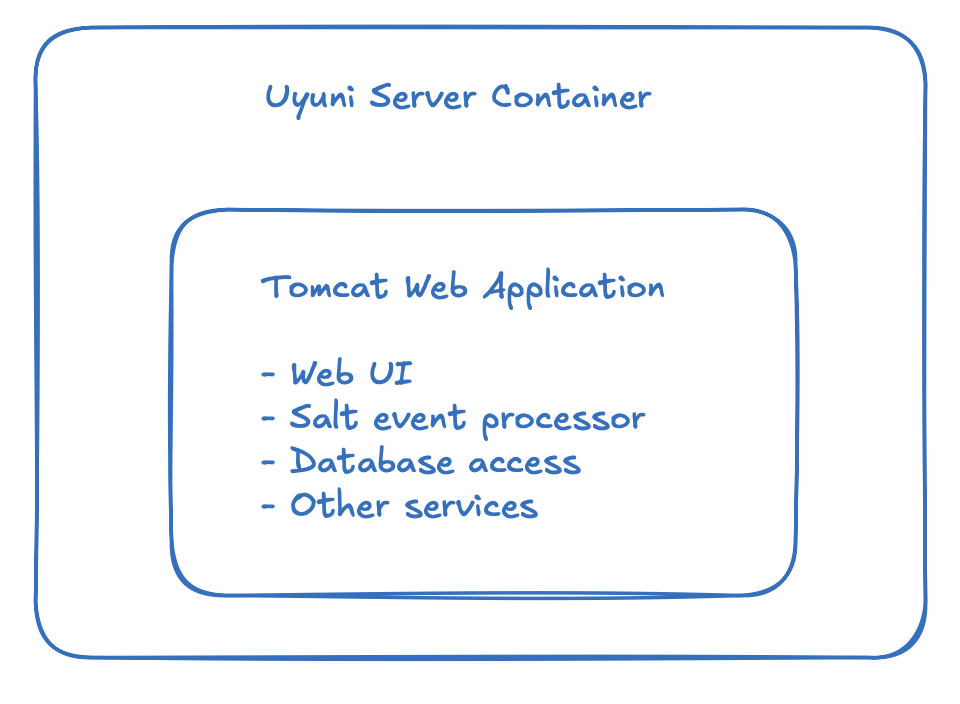
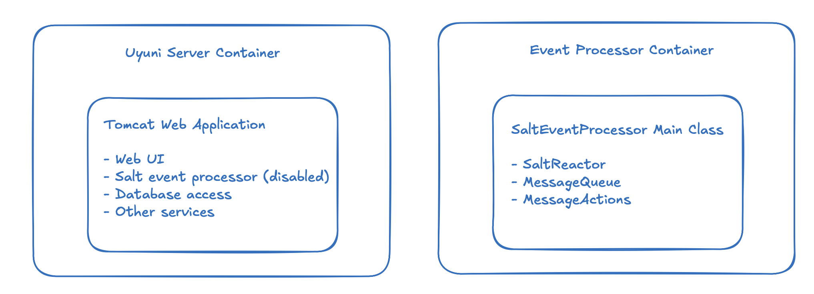
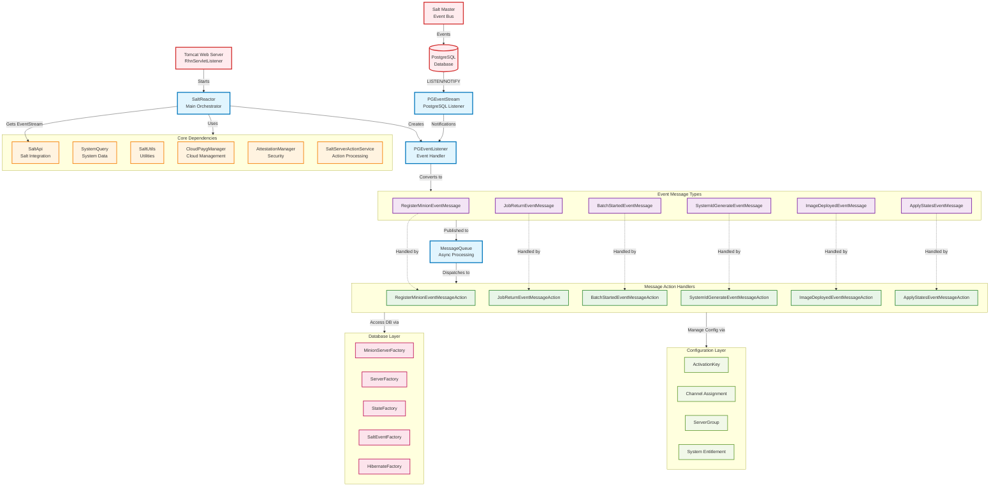

# Salt Event Processor Extraction - Implementation Notes

**Goal**: Extract Salt Event Processor from Uyuni monolith into standalone microservice.

**Context**: Containerize the Salt event processing functionality that currently runs embedded within the main Uyuni Tomcat server.

**Approach**: Microservice extraction, disable functionality in Tomcat, create standalone service that reuses existing logic.

---

## Architecture Design

### Before: Monolithic Architecture

Salt event processor was embedded in Tomcat Web Application, which made it tightly coupled with the main Uyuni server. This architecture made it difficult to scale or manage Salt event processing independently.




### After: Microservice Architecture

Salt event processor can be started as an standalone service. This allows it to run independently of the main Uyuni server, improving scalability and maintainability.



---

## Salt Event Processing Architecture

### Event Flow Architecture



### Key Components:

**SaltReactor**: Main orchestrator that coordinates event processing 

**PGEventStream**: PostgreSQL LISTEN/NOTIFY mechanism for real-time event detection 

**PGEventListener**: Converts raw Salt events into corresponding message objects

**susemanager susesaltevent Table**: Database table that queues unprocessed Salt events

**Critical Insight**: Events accumulate in `susesaltevent` table when no processor is actively polling them

## Implementation Details

### 1. Disable Salt Event Processor in Tomcat server

**Modified**:`com.redhat.rhn.webapp.RhnServletListener.java`

### 2. Standalone Salt Event Processor Implementation

**Created**:`com.suse.saltevent.SaltEventProcessor.java`

```java
package com.suse.saltevent;

import com.redhat.rhn.GlobalInstanceHolder;
import com.suse.manager.reactor.SaltReactor;
import org.apache.logging.log4j.LogManager;
import org.apache.logging.log4j.Logger;

public class SaltEventProcessor {
    private static final Logger LOG = LogManager.getLogger(SaltEventProcessor.class);

    public static void main(String[] argv) {
        SaltReactor saltReactor = new SaltReactor(
                GlobalInstanceHolder.SALT_API,
                GlobalInstanceHolder.SYSTEM_QUERY,
                GlobalInstanceHolder.SALT_SERVER_ACTION_SERVICE,
                GlobalInstanceHolder.SALT_UTILS,
                GlobalInstanceHolder.PAYG_MANAGER);
        saltReactor.start();
        LOG.error("Salt reactor started");
    }
}
```

**Key Design Decision**: Reuse existing`SaltReactor`class instead of rewriting event processing logic. This maintains compatibility and reduces risk.

Salt event processing no longer starts automatically with Tomcat, allowing external processor to handle events.

### 3. Configuration Management

**Created**:`saltEventProcessor.conf`

```bash
#********************************************************************
# Salt Event Processor Properties
#********************************************************************
SALTEN_LIBRARY_PATH="/usr/lib:/usr/lib64"
SALTEN_RHN_CLASSPATH="/usr/share/rhn/classes"
SALTEN_RHN_JARS="/usr/share/rhn/lib/spacewalk-asm.jar:/usr/share/rhn/lib/rhn.jar:/usr/share/rhn/lib/java-branding.jar"
SALTEN_JARS="/usr/share/spacewalk/taskomatic/*"
SALTEN_JAVA_OPTS="--add-modules java.annotation,com.sun.xml.bind --add-exports java.annotation/javax.annotation.security=ALL-UNNAMED --add-opens java.annotation/javax.annotation.security=ALL-UNNAMED"
SALTEN_INIT_MEMORY=128
SALTEN_MAX_MEMORY=512
JAVA_OPTS="-Xdebug -Xrunjdwp:transport=dt_socket,address=*:8006,server=y,suspend=n"
```

**Purpose**: Externalizes all Java runtime configuration, memory settings, and classpath definitions for the standalone service.

### 4. Process Startup Script

**Created**:`mgr_salt_event_processor` as salt event processor service start script

```bash
#!/bin/sh
# SaltEventProcessorDaemon start script
echo "Loading Salt Event Processor configuration..."
. /etc/rhn/saltEventProcessor.conf
echo "Configuration loaded successfully"

SALTEN_PARAMS="-Dibm.dst.compatibility=true -Dfile.encoding=UTF-8 -Xms${SALTEN_INIT_MEMORY}m -Xmx${SALTEN_MAX_MEMORY}m ${SALTEN_CRASH_PARAMS} ${SALTEN_JAVA_OPTS}"
SALTEN_CLASSPATH="${SALTEN_RHN_CLASSPATH}:${SALTEN_RHN_JARS}:${SALTEN_JARS}"

# Add logging configuration
LOG4J_CONFIG="-Dlog4j2.configurationFile=file:///usr/share/rhn/classes/log4j2_saltEventProcessor.xml"

echo "Starting Salt Event Processor..."
/usr/bin/java -Djava.library.path=${SALTEN_LIBRARY_PATH} -classpath ${SALTEN_CLASSPATH} ${SALTEN_PARAMS} ${LOG4J_CONFIG} ${JAVA_OPTS} ${JAVA_AGENT} com.suse.saltevent.SaltEventProcessor

```

**Features**:

- Configuration loading from external file
- Proper classpath setup including all Uyuni dependencies
- Logging configuration
- Debug port setup for development

### 5.  Added logging configuration into startup scripts

```bash
# Add logging configuration
LOG4J_CONFIG="-Dlog4j2.configurationFile=file:///usr/share/rhn/classes/log4j2_saltEventProcessor.xml"
```

### 6. Logging Configuration

**Problem**: The standalone Salt Event Processor needed its own logging configuration separate from the main Uyuni server to enable proper monitoring, debugging, and troubleshooting.

**Created**:`log4j2_saltEventProcessor.xml`

```xml
<?xml version="1.0" encoding="UTF-8" ?>
<Configuration status="warn" name="SaltEventProcessorConfig">
    <Appenders>
        <Console name="console" target="SYSTEM_OUT">
            <PatternLayout pattern="%d [%t] %-5p %c{1} - %m%n" />
        </Console>
    </Appenders>
    <Loggers>
        <Logger name="com.suse.saltevent" level="debug" additivity="false"/>
        <Logger name="com.suse.manager.reactor" level="info" additivity="false"/>
        <Root level="info">
            <AppenderRef ref="console" />
        </Root>

        *<!-- Ignore deprecation not yet addressed to reduce log noise -->*
        <Logger name="org.hibernate.orm.deprecation" level="warn">
            <Filters>
                <RegexFilter regex="HHH90000009: .*" onMatch="DENY" onMismatch="NEUTRAL"/>
                <RegexFilter regex="HHH90000022: .*" onMatch="DENY" onMismatch="NEUTRAL"/>
                <RegexFilter regex="HHH020100: .*" onMatch="DENY" onMismatch="NEUTRAL"/>
            </Filters>
        </Logger>

        *<!-- Silence ehcache warnings -->*
        <Logger name="org.hibernate.cache.ehcache.AbstractEhcacheRegionFactory" level="error" />
        
        <Logger name="com.redhat.rhn.common.conf.Config" level="debug" />
    </Loggers>
</Configuration>
```

**Integration in Startup Script**:

```bash
# Add logging configuration to mgr_salt_event_processor
LOG4J_CONFIG="-Dlog4j2.configurationFile=file:///usr/share/rhn/classes/log4j2_saltEventProcessor.xml"

# Include in Java command
/usr/bin/java -classpath ${SALTEN_CLASSPATH} ${SALTEN_PARAMS} ${LOG4J_CONFIG} com.suse.saltevent.SaltEventProcessor
```

**Enhanced SaltEventProcessor with Better Logging**:

```java
public class SaltEventProcessor {
    private static final Logger LOG = LogManager.getLogger(SaltEventProcessor.class);

    public static void main(String[] argv) {
        try {
            LOG.info("Starting Salt Event Processor");

            LOG.debug("Creating SaltReactor...");
            SaltReactor saltReactor = new SaltReactor(
                    GlobalInstanceHolder.SALT_API,
                    GlobalInstanceHolder.SYSTEM_QUERY,
                    GlobalInstanceHolder.SALT_SERVER_ACTION_SERVICE,
                    GlobalInstanceHolder.SALT_UTILS,
                    GlobalInstanceHolder.PAYG_MANAGER,
                    GlobalInstanceHolder.ATTESTATION_MANAGER);

            LOG.info("SaltReactor created successfully");
            LOG.debug("Starting SaltReactor...");
            saltReactor.start();
            LOG.info("SaltReactor started");

            *// Keep alive with periodic status logging*
            // while (true) {
            //    Thread.sleep(30000);
            //    LOG.info("Salt Event Processor still running...");
            //}

        } catch (Exception e) {
            LOG.error("Salt Event Processor failed to start: " + e.getMessage(), e);
            System.exit(1);
        }
    }
}
```

**Logging Strategy Design**:

- Separate log4j2 config allows independent log level control
- I set different log levels for different components:
    - `com.suse.saltevent`: DEBUG level for detailed extraction debugging
    - `com.suse.manager.reactor`: INFO level for Salt event processing
    - `Root`: INFO level for general application logging
- Filters to suppress known Hibernate deprecation warnings to reduce noise
- Logs to stdout for container environments

---

## Test: Start the Extracted Event Processor

### 1.**Build and Deploy Updated JAR**

build the updated code, which disabled saltReactor and extracted Salt event processor.

```bash
cd uyuni/java/
sudo ant -f manager-build.xml refresh-branding-jar -Ddeploy.mode=container deploy-restart
```

### 2.**Copy Runtime Files to Container**

```bash
*# Copy startup script to uyuni server and change access permission*
sudo mgrctl cp java/code/src/com/suse/saltevent/mgr_salt_event_processor server:/ 
sudo mgrctl exec chmod +x /mgr_salt_event_processor

*# Copy configuration file*
sudo mgrctl cp java/code/src/com/suse/saltevent/saltEventProcessor.conf server:/etc/rhn/
```

### 3.**Run the Extracted Processor using the start script**

```bash
# enter uyuni-server
sudo mgrctl term
./mgr_salt_event_processor
```

---

## Current Extraction Strategy Analysis

**Key design considerations:**

- We reused the dependencies and leveraged existing`SaltReactor`class to minimize rewrite work
- We used separate config file to externalize runtime configurations
- This is the minimum viable version of Salt event processor service extraction

**Limitation of current implementation**

- With the current implementation, we still depends on full spacewalk-java JAR (large dependency)
- This extracted service access to same `uyuni-db` database as main Uyuni server

## Dependency Analysis

**Current Dependencies**:

- `spacewalk-java`(full JAR including web components needed)
- `spacewalk-taskomatic`(for logging)
- Database connection (via existing Uyuni config)

---

## Next Step

- Test service can be started with current script
- Integration testing for the extracted service
    - Test connection to database
    - Test existing event processing logic preserved