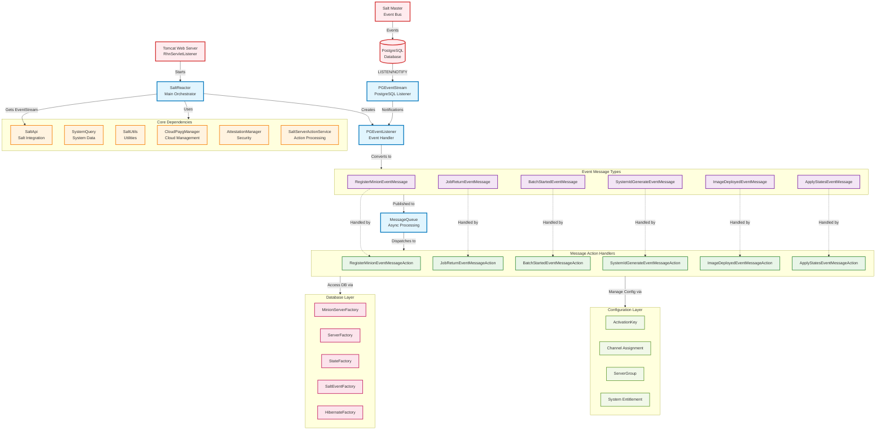
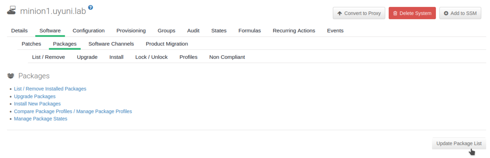
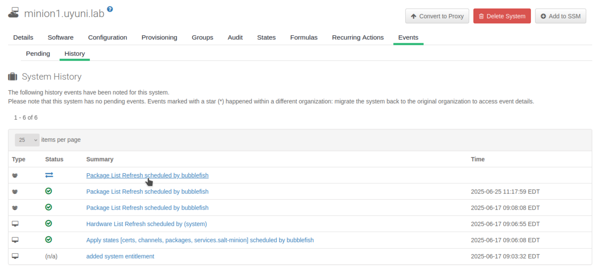
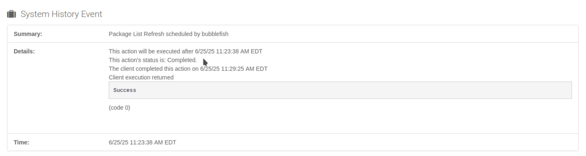

# Salt Event Processor Extraction - Initial Testing and Validation

**Goal**: Validate that the extracted Salt Event Processor functions correctly in isolation

**Context**: After successfully extracting the Salt Event Processor from the Uyuni server, need to prove that the extraction works correctly. The test should show that events are properly processed by the standalone processor in same logic while the main Uyuni server continues to function with the Salt reactor disabled.

**Testing Strategy**: Disable Salt event processing in main Uyuni server, generate Salt events, verify events are not polled from database, then start extracted processor and confirm events are polled and processed.

---

## Salt Event Processing Architecture

### Event Flow Architecture



### Key Components:

**`SaltReactor`**: Main orchestrator that coordinates event processing 

**`PGEventStream`**: PostgreSQL LISTEN/NOTIFY mechanism for real-time event detection 

**`PGEventListener`**: Converts raw Salt events into corresponding message objects

### **Event Processing Pipeline**

Data flow: Salt Master → PostgreSQL → PGEventStream → PGEventListener → Message Queue → Action Handlers

### **Database Event Queuing Mechanism of Uyuni**

**`susesaltevent` Table**: Database table that queues unprocessed Salt events. This table serves as a persistent event queue, schema is:

- **id**: Unique event identifier
- **minion_id**
- **data**: JSON payload with complete event information
- **queue**: Priority/routing information (0=high priority, 2=normal)

**Critical Insight**: Events accumulate in `susesaltevent` table when no processor is actively polling them

---

## Test Environment Setup

### Initial State Preparation

### 1. Build and Deploy Code with Disabled SaltReactor

```bash
# Navigate to Java source directory
cd uyuni/java/

# Build and deploy modified code (SaltReactor disabled in RhnServletListener)
sudo ant -f manager-build.xml refresh-branding-jar -Ddeploy.mode=container deploy-restart
```

**This Deployment**:

- Compiles all Java source (including disabled `SaltReactor` startup)
- Creates updated `rhn.jar` with `SaltEventProcessor` class
- Deploys to container at `/usr/share/rhn/lib/rhn.jar`
- Links JARs for Taskomatic

`deploy-restart` will restart the Tomcat and Taskomatic with my new code

**After this, Uyuni server runs normally but Salt event processing is disabled.**

### 2. Add Extracted Processor Runtime Files

Adding runtime files to uyuni-server for starting the Salt event processor later

```bash
# Copy startup script to Uyuni server
sudo mgrctl cp java/code/src/com/suse/saltevent/mgr_salt_event_processor server:/

# Make script executable
sudo mgrctl exec chmod +x /mgr_salt_event_processor

# Copy configuration file
sudo mgrctl cp java/code/src/com/suse/saltevent/saltEventProcessor.conf server:/etc/rhn/
```

When replaced, the Salt event processor should be disabled in the uyuni server, while other functions of uyuni server remain not affected.

### 3. Minion Registration

To complete a full cycle test, we need to register a Salt minion server (minion1.uyuni.lab) to mock the real production environment. By triggering Salt event in Salt minion, we can test the full Salt event processing cycle.

Follow the guide [TODO]

---

## Test Execution

## Phase 1: Event Generation with Disabled Processor

### 1.1 Trigger Salt events

### Option 1: Generate Minion Events from Client-side

Using Client server to schedule Salt actions .

For example, in minion server `minion1.uyuni.lab`, we install some package, and this will trigger salt event related to installation.

```bash
# On minion server - trigger restart event
minion1:~ # systemctl restart venv-salt-minion

# Attempt package operations to generate events
minion1:~ # zypper install htop
minion1:~ # zypper update
```

### Option 2: Generate Events from Server-side

Using Uyuni Web UI to schedule Salt actions.

Here we use “Update Package List” to schedule package refresh event for minion `minion1.uyuni.lab`:

- Navigate to: Systems → minion1.uyuni.lab → Software → Packages → Update Package List



- We will see pending event in System history in minion `minion1.uyuni.lab`



**Expected Behavior**: Action status shows "Picked Up" but never completes because events aren't being processed.

### 1.2. Verify Event Accumulation in database

```bash
# Enter Uyuni server SQL mode
server:~ # mgradm support sql -i

# Check if there are unprocessed events in susesaltevent table
susemanager=> select * from susesaltevent;
```

**Expected Results**:

```sql
 id  |     minion_id     |                                    data                                     | queue
-----+-------------------+-----------------------------------------------------------------------------+-------
 110 | minion1.uyuni.lab | {"tag": "salt/minion/minion1.uyuni.lab/start", "data": {...}}              |     2
 111 | minion1.uyuni.lab | {"tag": "salt/job/20250625032101504322/ret/minion1.uyuni.lab", "data": {}} |     2
 112 | minion1.uyuni.lab | {"tag": "salt/beacon/minion1.uyuni.lab/reboot_info/", "data": {...}}       |     2
 117 |                   | {"tag": "salt/batch/20250625152339672986/start", "data": {...}}            |     0
(4 rows)
```

**Event Types Observed**:

- **Minion Start Event**: When minion service restarts
- **Job Return Event**: Salt job completion notifications
- **Beacon Event**: System state monitoring (reboot needed, etc.)
- **Batch Start Event**: Scheduled action initiation

## Phase 2: Start Extracted Processor and Verify Processing

### 2.1 Start the Extracted Salt Event Processor

```bash
# Enter Uyuni server container
sudo mgrctl exec -it bash

# Start the extracted processor
./mgr_salt_event_processor
```

**Expected Startup Output**:

Successful startup of `SaltEventProcessor.main()` :

```
Listening for transport dt_socket at address: 8006
SLF4J: Class path contains multiple SLF4J bindings.
SLF4J: Found binding in [jar:file:/usr/share/java/log4j/log4j-slf4j-impl.jar!/org/slf4j/impl/StaticLoggerBinder.class]
SLF4J: Found binding in [jar:file:/usr/share/susemanager/www/tomcat/webapps/rhn/WEB-INF/lib/log4j-slf4j-impl-2.17.2.jar!/org/slf4j/impl/StaticLoggerBinder.class]
SLF4J: See http://www.slf4j.org/codes.html#multiple_bindings for an explanation.
SLF4J: Actual binding is of type [org.apache.logging.slf4j.Log4jLoggerFactory]
```

Now, upon the start of Salt event processor, the event should be polled out by Salt event processor and been processed.

### 2.2 Verify Event Processing results

```bash
# In separate SQL session, monitor susesaltevent table
susemanager=> select * from susesaltevent;
```

**Expected Result After Processing**:

```sql
 id | minion_id | data | queue
----+-----------+------+-------
(0 rows)
```

Table becomes empty, indicating all queued events have been processed.

### 2.3 Confirm Action Completion

Check Uyuni Web UI for the scheduled "Update Package List" action:

**Before Processor Start**: Status = "Picked Up" 

**After Processor Start**: Status = "Completed"



---

## Test Results

### **Functionality test result:**

- Main Uyuni server functions normally with Salt reactor disabled.
- Web interface remains accessible and functional
- Standalone processor starts successfully
- Only Salt event processing is affected

### **Integration test result:**

- Tested database interactions to verify transaction handling.
    - Events are properly queued in `susesaltevent` table when processor disabled.
    - All queued events processed and removed from database
- Scheduled actions complete properly after starting processor
- Event processing logic and performance appears unchanged

### **Conclusion**

The extracted processor successfully recreates the event processing pipeline independently of the main Uyuni server.

### **Not Tested in This Phase:**

- High-volume event processing
- Long-running processor stability
- Error handling and recovery