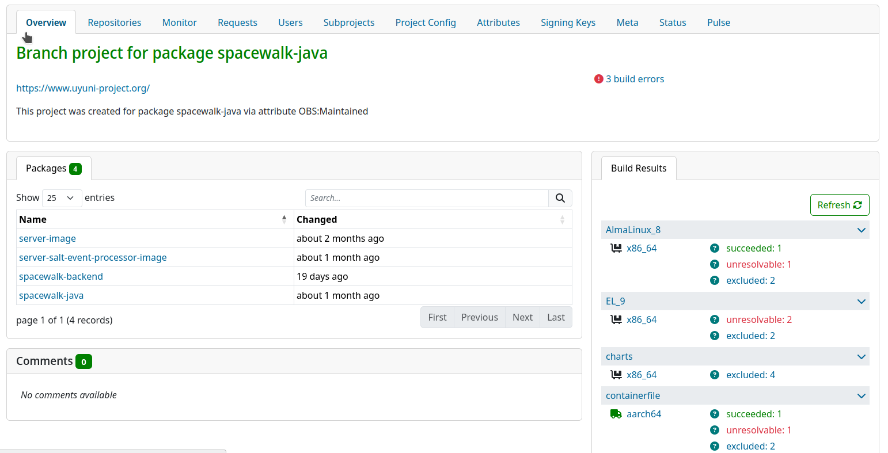
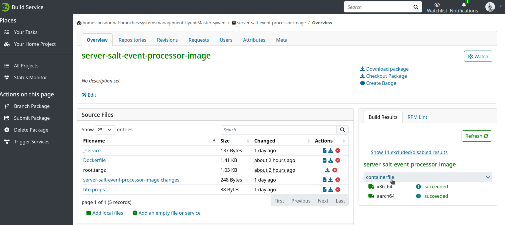
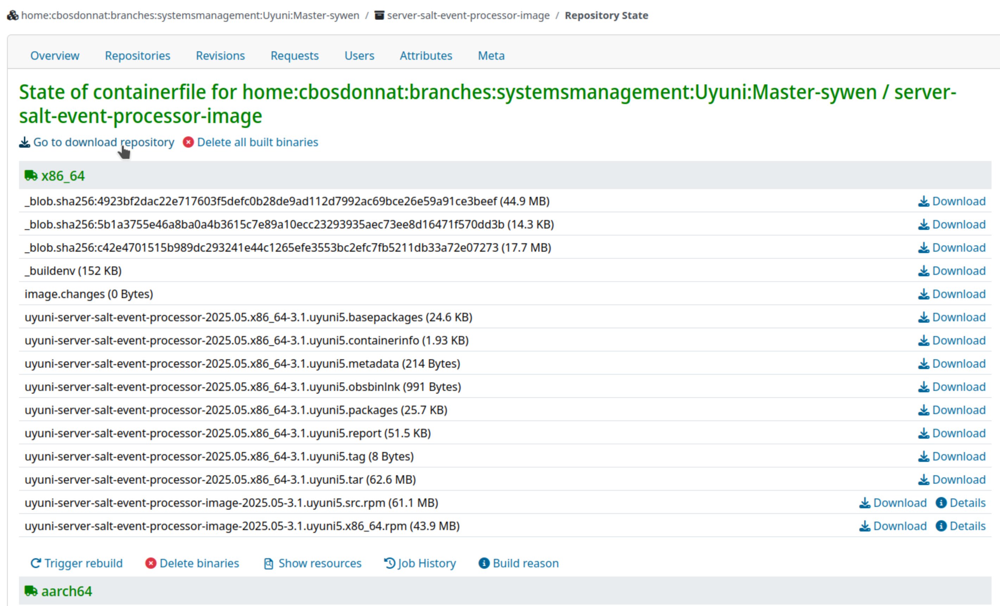
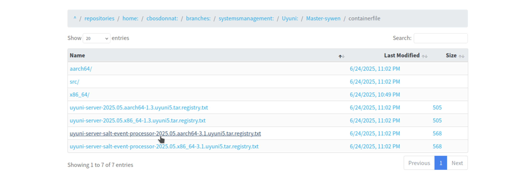

# Salt Event Processor Image Build and Test

**Goal**: Build and test the containerized Salt Event Processor using Open Build Service (OBS)

**Context**: After implementing the container infrastructure (Dockerfile, runtime files), we need to build the actual container image using Uyuni's Open Build Service workflow. This process involves building the updated Uyuni Java package, creating the container image, and testing the deployable.

**Approach**: Use Uyuni's engineering tools (`rel-eng`) to build packages through OBS, and test the container image.

---

## Uyuni's Build Infrastructure

### Open Build Service (OBS)

The Open Build Service (OBS) is the build system for all Uyuni packages and container images, it automates the building and distribution of binary packages from source code across multiple operating systems.

[Open Build Service](https://openbuildservice.org/)

### **Uyuni Release Engineering (`rel-eng`)**

Rel-eng are tools used to help Uyuni release engineers package and submit the various projects.

[Uyuni releng tools](https://github.com/uyuni-project/uyuni-releng-tools)

In `rel-eng`, the script `build-packages-for-obs` is used together with `push-packages-to-obs` for building a source from git and pushing it to a project on the Open Build Service and build it there.

[Building-an-RPM-in-an-OBS-branch-package](https://github.com/uyuni-project/uyuni/wiki/Building-an-RPM-in-an-OBS-branch-package)

### **Build Flow**:

```
Local Changes → rel-eng → OBS → Container Registry → Testing
```

---

## Pre-Build Setup

1. Build Tools Installation

    ```bash
    # Install Uyuni release engineering tools
    sudo zypper in uyuni-releng-tools
    ```

2. Create OBS Branch if not created yet

    ```bash
    # Branch from uyuni master 
    osc branch systemsmanagement:Uyuni:Master
    # Creates: home:yourusername:branches:systemsmanagement:Uyuni:Master
    ```

3. Environment Configuration

    ```bash
    # Set OBS project for build targeting
    export OBS_PROJ=home:yourusername:branches:systemsmanagement:Uyuni:Master
    export OSCAPI=https://api.opensuse.org
    export TEST=--test  # Use test mode for initial builds
    ```

    - **OBS_PROJ**: Target OBS project where packages will be built
    - **OSCAPI**: OBS API endpoint for package submission
    - **TEST**: Test flag prevents automatic submission (safer for development)

---

## Build Process

### Package Dependencies Chain

First, we need to analyze the dependency package of Salt event processor container.

```
spacewalk-java (updated SaltEventProcessor)
    ↓
server-salt-event-processor-image (Salt event processor container)
    ↓
server-image (main Uyuni container - affected by java code changes)
```

Each package depends on the previous one, so builds must happen sequentially.

### Stage 1: Build updated dependency package

1. Navigate to Java Source

    ```bash
    # Navigate to Uyuni Java source directory
    cd uyuni/java/
    ```

2. Build and Push Java Package

    ```bash
    # Build spacewalk-java with SaltEventProcessor changes
    build-packages-for-obs spacewalk-java && push-packages-to-obs
    ```

3. Check Build Progress

   Check build status in OBS web interface, navigate to `https://build.opensuse.org/project/show/$OBS_PROJ`

   Look for `spacewalk-java` package build status

   


### Stage 2: Build Container Image

**Objective**: Build the server-salt-event-processor-image container using updated `spacewalk-java` package

1. Create file [server-salt-event-processor-image](https://github.com/uyuni-project/uyuni/pull/10493/files#diff-c92331adb60f338ee8b5d1619c437f9c7168b7e94583b9bd6735a37b602378f6) in directory `uyuni/rel-eng`. `rel-eng` looks for package definition in this file and it will point `rel-eng` to the build source directory, this file should contain:

    ```
    5.1.6 containers/server-salt-event-processor-image/
    ```

2. Build Container Image

    ```bash
    # Navigate to Uyuni Java source directory
    cd uyuni/java/
    
    # Build the container image package
    build-packages-for-obs server-salt-event-processor-image && push-packages-to-obs
    ```


**What happens in build process?**

1. **Source Preparation**: `rel-eng` packages `containers/server-salt-event-processor-image/` directory
2. **Dockerfile Processing**: OBS processes Dockerfile with runtime files (`root.tar.gz`)
3. **Dependency Installation**: Installs updated spacewalk-java from Stage 1
4. **Container Build**: Creates final container image
5. **Registry Push**: Pushes image to OBS container registry

### Stage 3: Build Affected Dependencies

**Objective**: Rebuild packages that depend on our changes

1. Build Affected Server Image

    ```bash
    # Navigate back to Java directory for server-image dependencies
    cd uyuni/java
    
    # Build main server image (affected by our Java changes)
    build-packages-for-obs server-image && push-packages-to-obs
    ```


---

## Image Testing Process

### 1. Find Image in OBS

1. Go to OBS web interface: `https://build.opensuse.org/project/show/$OBS_PROJ`
2. Navigate to: **Repositories** → **Images** → **server-salt-event-processor-image**
3. Go to  **"containerfile"**

   

4. Go to  **"Go to download repository"**

   

5. Find appropriate image for your architecture

   

   Image example:

    ```
    registry.opensuse.org/home/cbosdonnat/branches/systemsmanagement/uyuni/master-sywen/containerfile/uyuni/server-salt-event-processor:latest
    ```


### 2. Container Testing Setup

- Pull and Test Image

    ```bash
    # Pull the built image from OBS registry
    podman pull registry.opensuse.org/home/cbosdonnat/branches/systemsmanagement/uyuni/master-sywen/containerfile/uyuni/server-salt-event-processor:latest
    
    # Test basic container functionality
    podman run --rm registry.opensuse.org/home/cbosdonnat/branches/systemsmanagement/uyuni/master-sywen/containerfile/uyuni/server-salt-event-processor:latest --help
    ```

- Production Testing of Salt Event Processor Iamge

    ```bash
    # Run container with production-like configuration
    podman run -n salt-events-processor \
      -e db_name=susemanager \
      -e db_port=5432 \
      -e db_host=db \
      --secret uyuni-db-user,type=env,target=db_user \
      --secret uyuni-db-pass,type=env,target=db_password \
      --network=container:uyuni-server \
      registry.opensuse.org/home/cbosdonnat/branches/systemsmanagement/uyuni/master-sywen/containerfile/uyuni/server-salt-event-processor:latest
    ```

  **Configuration**:

    - **Database Connection**: Salt event processor service connects to existing Uyuni database `susemanager`, and use the `susesaltevent` table for queueing events
    - **Network Sharing**: Use same network as uyuni-server container
    - **Secrets Management**: Secure handling of database credentials

### 3. Container status check

```bash
# Monitor startup logs
podman logs -f salt-events-processor

# Monitor container resource usage
podman stats salt-events-processor
```

### 4. Integration Testing (validates event processing)

[Salt Event Processor Extraction - Initial Testing and Validation](Salt-Event-Processor-Extraction-Initial-Testing.md)

---

## Next Step

This build process successfully transforms the extracted Salt Event Processor from source code into a production-ready container image using Uyuni's open source build.

Next step is to integrate the container deployment and life cycle management into Uyuni-tools.