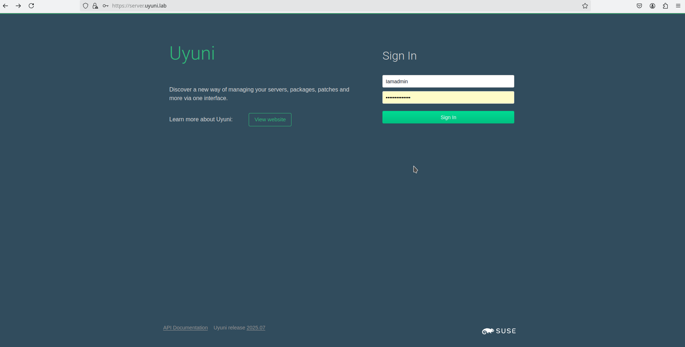
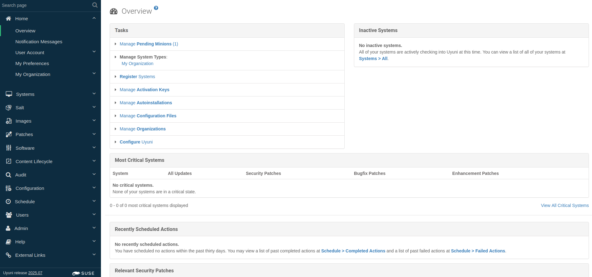

# Uyuni Server Production Environment Setup
**Phase**: Environment Setup

**Goal**: Install production-ready Uyuni server for development and testing

**Context**: Need to establish a working Uyuni server environment to support uyuni development. It requires a production installation that could help me understand the Uyuni architecture and how it works. It is also the runtime environment for testing my extracted service.

**Challenges**: I navigated through multiple installation approaches (legacy and containerized version) to find the appropriate method for server setup workflow.

---

## Initial Research and Approach Selection

### Project Phase: Documentation Exploration

**Initial Option**: Followed contributing guidelines

- **Source**: [Java Development Environment](https://github.com/uyuni-project/uyuni/wiki/Java-Development-Environment)
- **Analysis**: It use is a Sumaform-based development environment. Sumaform is designed for development infrastructure, not containerized server deployment. I realized this is not the most efficient way for this project since we are building in a containerized environment

**Better Option**: Container deployment approach

- **Source**: [Uyuni Container Deployment Guide](https://www.uyuni-project.org/uyuni-docs/en/uyuni/installation-and-upgrade/container-deployment/uyuni/server-deployment-uyuni.html)
- **Approach**: Production container deployment using mgradm
- **Rationale**: Aligns with project goals of containerized architecture

---

## My Installation Process

### Environment Prerequisites

**My Host System Configuration**:

- **Host System**: aarch64
- **Virtual Machine:** VMware Fusion
- **OS**: OpenSUSE Leap 15.6 (compatible with Uyuni requirements though it requires  openSUSE Leap Micro 6.1)
- **Container Runtime**: Podman (installed and configured)
- **Storage**: 100GB VM allocation
- **Network**: Host networking with FQDN resolution
- **Privileges**: Root access for container management

### Step-by-Step Installation

### 1. System Preparation

follow this to install uyuni tools for use with container

[4. Installing Uyuni Tools For Use With Containers](https://www.uyuni-project.org/uyuni-docs/en/uyuni/installation-and-upgrade/container-deployment/uyuni/server-deployment-uyuni.html#_installing_uyuni_tools_for_use_with_containers)

### 2. Configuration File Creation

**Created**: `mgradm.yaml` in root directory

```bash
# Create configuration file as root user in root 
sudo vi mgradm.yaml
```

**Configuration Content**:

```yaml
# Database password. Randomly generated by default
db:
  password: dbpassword

# Password for the CA certificate
ssl:
  password: sslpassword

# Your SUSE Customer Center credentials
scc:
  user: username
  password: password

# Organization name
organization: Uyuni

# Email address sending the notifications
emailFrom: notifications@example.com

# Administrators account details
admin:
  password: adminpassword
  login: Iamadmin
  firstName: SpongeBob
  lastName: Square
  email: example@email.com
```

Reference: [**Custom YAML Configuration and Deployment with `mgradm`**](https://www.uyuni-project.org/uyuni-docs/en/uyuni/installation-and-upgrade/container-management/mgradm-yaml-custom-configuration.html)

### 3. FQDN Configuration

Container requires proper FQDN resolution, so I configured `server.uyuni.lab` as FQDN

### 4. Uyuni Server Deployment

**Installation Command**:

```bash
sudo mgradm -c mgradm.yaml install podman server.uyuni.lab
```

**Installation Process Monitoring**:

```bash
# Monitor installation progress
journalctl -f -u uyuni-server

# Check container status during installation
podman ps -a
```

### 5. Installation Verification

**Container Status Check**:

```bash
# Verify Uyuni container is running
podman ps
# Should show uyuni-server container

# Check systemd service
systemctl status uyuni-server

# Verify port accessibility
netstat -tlnp | grep :443
```

**Web Interface Access**:

```bash
# Access via browser
URL: https://server.uyuni.lab
Or: https://localhost
```

## **Expected Result**:

Uyuni web interface login page accessible in `https://server.uyuni.lab` or `https://localhost`

**Uyuni server login:**

- **Username**: `Iamadmin` (as configured in mgradm.yaml)
- **Password**: `adminpassword` (as configured)



## Container Management Commands

**Essential Management Commands**:

```bash
# Access uyuni server container shell
mgrctl exec -it bash

# View container logs
journalctl -u uyuni-server -f

# Restart Uyuni services
mgradm restart

# Check container resource usage
podman stats uyuni-server
```

## Installation Validation

**Functional Testing**:

```bash
# Verify web services
mgrctl exec systemctl status tomcat

# Check Salt master status
mgrctl exec systemctl status salt-master

# Test database connectivity
mgrctl exec psql -U susemanager -d susemanager -c "SELECT *;"
```

**Web Interface Testing**:

1. Login successfully
2. Main dashboard loads without errors
3. All main menu items accessible
4. Server details displayed correctly



